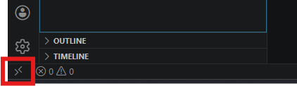

# アカウント連携と起動手順

## 連絡先

**APD GrowthTech推進部**  
apd-gt-dpt@idenet.co.jp

**個人連絡先**  
代表：春木 拓也 　080-4297-6320  

---

## PC受け取りに関するお知らせ

東京勤務の方：本社3Fにお越しいただき、内線電話よりメール文に記載の番号へお電話ください。または、部署長にご相談のうえ事業所への持参をご依頼ください。  
地方勤務の方：各地方拠点に送付済みですので、お手数ですがそちらまでお受け取りにお越しください。

> **注意:** PC受け取り時または部署長より以下の情報をお渡しします。大切に保管してください。
> - BIOS パスワード
> - PC アカウント・パスワード
> - WSL アカウント・パスワード

---

## セットアップ

### 1. 事前準備

Windows Update を確認し、アップデートがある場合は適用しておく。

以下の2つのアカウントを作成しておく：

> **注意:** アカウント作成には会社メールアドレスを使用すること。

**① Claude Code アカウント（Team Standard プラン）**

5/11（月）に招待メールをお送りします。以下の手順でセットアップしてください。

1. 届いた招待メールを開き、招待リンクをクリックする
2. 会社のメールアドレスでアカウントを作成する
3. チームワークスペースへの参加を完了する

> 招待メールが届いていない場合は、お手数ですがご連絡いただくか、届くまでしばらくお待ちください。

> **注意:** Claude Code には5時間ごとの利用上限と週間の利用上限があります。研修での使用を考慮し、使用量を意識しながらご利用ください。
>
> **使用量の確認方法:**
> 1. ブラウザで https://claude.ai を開く
> 2. 左下のユーザーアイコン → **「Settings」** を開く
> 3. **「Usage」** から現在の利用状況を確認できる

**② GitHub アカウント（下流工程研修のみ）**

以下の手順でセットアップしてください。

1. https://github.com/signup にアクセスする
2. 会社のメールアドレスでアカウントを作成する

---

### 2. WSL起動

1. Windows のスタートメニューまたはタスクバーから **「Visual Studio Code」** を起動する

2. VSCode 左下の **`><`** アイコンをクリックし、**「Connect to WSL」** を選択する

   

   > 左下のステータスバーに **「WSL: Ubuntu-22.04」** と表示されれば接続完了

   

---

### 3. 疎通確認

VSCode のメニューバー → **Terminal** → **New Terminal**（または `Ctrl+@`）で VSCode 内のターミナルを開き、外部サービスへの接続を確認する。

```bash
curl -s https://claude.ai > /dev/null && echo "Claude.ai: OK" || echo "Claude.ai: NG"
```

```bash
# 下流工程研修のみ
curl -s https://github.com > /dev/null && echo "GitHub: OK" || echo "GitHub: NG"
```

>  `OK` と表示されれば問題ない。`NG` の場合はネットワーク設定を確認すること。解決が難しそうであればAPD GrowthTech推進部へ連絡すること。

---

### 4. Claude Code 認証

VSCode のメニューバー → **Terminal** → **New Terminal**（または `Ctrl+@`）で VSCode 内のターミナルを開き、以下を実行する。

> ※ 以下の手順は 2026/04 現在の画面フローです。アップデートにより表示が変わる場合があります。

```bash
claude
```

起動後、以下の順に操作する：

1. **テーマ選択**が表示される → `Enter`
2. **ログイン方法の選択**が表示される → `Enter`
3. ターミナルに **URL** が表示される → ブラウザで開く
4. ブラウザに **「Claude Code が Claude chat アカウントへの接続を希望しています」** と表示される → **「承認」** ボタンをクリック
5. ブラウザに **認証コード** が表示される → ターミナルに貼り付けて `Enter`
6. ターミナルに **「Login successful. Press Enter to continue」** と表示される → `Enter`
7. **セキュリティノート**が表示される → `Enter` で次へ
8. **ターミナル統合の設定**（Terminal setup）の選択が表示される →  `Enter`
9. **フォルダの信頼確認**（セキュリティガイド）が表示される → 信頼する場合は許可して進む

> 以上で認証完了。`exit` または `Ctrl+C` で終了できる。

---

### 5. GitHub CLI 認証（下流工程研修のみ）

VSCode のメニューバー → **Terminal** → **New Terminal**（または `Ctrl+@`）で VSCode 内のターミナルを開き、以下を実行する。

```bash
gh auth login
```

以下の順に選択する（矢印キーで選択し Enter）：

| 質問 | 選択・入力 |
|---|---|
| What account do you want to log into? | `GitHub.com` |
| What is your preferred protocol for Git operations? | `HTTPS` |
| Authenticate Git with your GitHub credentials? | `Yes` |
| How would you like to authenticate GitHub CLI? | `Login with a web browser` |

ターミナルにワンタイムコード（例：`XXXX-XXXX`）が表示されるので手順に従う：

1. 表示されたURLをブラウザで開く
2. GitHub にログインした状態でワンタイムコードを入力する
3. 認証が完了したらターミナルに戻る

```bash
# 認証確認
gh auth status
```

> **結果例**
> ```
> ✓ Logged in as <ユーザネーム>
> ✓ Git operations configured for HTTPS
> ```

---

### 6. Office Viewer のインストール（上流工程研修のみ）

Excel・Word などの Office ファイルを VSCode 上で確認したい場合にインストールする。

Extensions view（`Ctrl+Shift+X`）を開き、**「Office Viewer」** を検索してインストールする。

| 拡張機能名 | 拡張機能ID |
|---|---|
| Office Viewer | `cweijan.vscode-office` |

---

### 7. 研修資料をダウンロード・配置する

1. メールで共有された URL にブラウザでアクセスし、パスワードを入力して ZIP ファイルをダウンロードする

2. ダウンロードした ZIP ファイルを右クリック → **その他のオプションを確認** → **7-Zip** → **ここに展開** で展開する

3. 展開してできたフォルダを開き、**その直下にあるファイル・フォルダをすべて選択**して、Windows エクスプローラーの **Linux → Ubuntu-22.04 → home → （ユーザー名）** にドラッグ&ドロップでコピーする

   > **注意:** 日本語名のフォルダごとではなく、その**中身**をコピーすること。

> **注意:** 研修資料の中に事前セットアップガイドが同梱されていますが、すでにセットアップ済みのため実行する必要はありません。

---

### 8. プロジェクトフォルダを開く

VSCodeのメニューバー → **File** → **Open Folder**（`Ctrl+K, Ctrl+O`）から  
WSL 上の展開したプロジェクトディレクトリを選択する。

---

## WSL起動手順（研修時）

### 1. VSCode を起動する

Windows のスタートメニューまたはタスクバーから **「Visual Studio Code」** を起動する。

### 2. WSL に接続する

左下のステータスバーが **「WSL: Ubuntu-22.04」** と表示されていれば接続済みのためスキップ。  
表示されていない場合は、左下の **`><`** アイコンをクリックし、**「Connect to WSL」** を選択する。


> 左下のステータスバーに **「WSL: Ubuntu-22.04」** と表示されれば接続完了


> または `Ctrl+Shift+P` → `WSL: Connect to WSL` で接続できる。

### 3. プロジェクトフォルダを開く

VSCodeのメニューバー → **File** → **Open Folder**（`Ctrl+K, Ctrl+O`）から  
WSL 上のプロジェクトディレクトリを選択する。

> 2回目以降は **File** → **Open Recent** から直接開ける。

### 4. ターミナルを開いて作業する

`Ctrl+@` または メニューバー → **Terminal** → **New Terminal** で  
WSL ターミナルが VSCode 内に開く。以降の作業はここで行う。
