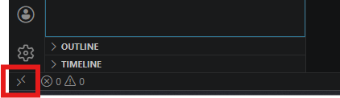
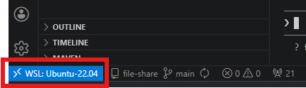

# アカウント連携と起動手順

> **対象:** 下流工程研修・AI駆動開発研修の受講者。上流工程研修の方は [05_UpstreamAccountSetup.md](05_UpstreamAccountSetup.md) を参照してください。

下流工程研修・AI駆動開発研修では、**VSCode** から **WSL（Ubuntu）** に接続して作業します。

## 連絡先

**APD GrowthTech推進部**  
apd-gt-dpt@idnet.co.jp

**個人連絡先**  
代表：春木 拓也 　080-4297-6320  

この手順書のどこかで止まった場合は、どの手順で何が表示されたかを添えてご連絡ください。

---

## PC受け取りに関するお知らせ

東京勤務の方：本社3Fにお越しいただき、内線電話よりメール文に記載の番号へお電話ください。または、部署長にご相談のうえ事業所への持参をご依頼ください。  
地方勤務の方：各地方拠点に送付済みですので、お手数ですがそちらまでお受け取りにお越しください。

> **注意:** PC受け取り時または部署長より以下の情報をお渡しします。大切に保管してください。
> - BIOS パスワード
> - PC アカウント・パスワード
> - WSL アカウント・パスワード

> 研修に必要なソフトウェアは、お渡しする時点でインストール済みです。ご自身でインストールしていただく作業はありません。

---

## セットアップ

### 1. 事前準備（会社貸与PCまたはAVD）

> 始める前に、Windows Update を確認し、アップデートがある場合は適用しておいてください。

以下のアカウントを作成しておいてください：

> **注意:** アカウント作成には会社メールアドレスを使用してください。会社メールは普段お使いの環境で確認してください（研修用 PC にメールの設定はしていません）。

**Claude アカウント（Team Standard プラン）**

招待メールをお送りします。以下の手順でセットアップしてください。

1. 届いた招待メールを開き、招待リンクをクリックする
2. 会社のメールアドレスでアカウントを作成する
3. チームワークスペースへの参加を完了する

> 招待メールが届いていない場合は、お手数ですがご連絡いただくか、届くまでしばらくお待ちください。

> **注意:** Claude Code には5時間ごとの利用上限と週間の利用上限があります。研修での使用を考慮し、使用量を意識しながらご利用ください。
>
> **使用量の確認方法:**
> 1. ブラウザで https://claude.ai を開く
> 2. 左下のユーザーアイコン → **「Settings」** を開く
> 3. **「Usage」** から現在の利用状況を確認できる

---

### 2. WSL起動

1. Windows のスタートメニューまたはタスクバーから **「Visual Studio Code」** を起動する

2. VSCode 左下の **`><`** アイコンをクリックし、**「Connect to WSL」** を選択する

   

   > 左下のステータスバーに **「WSL: Ubuntu-22.04」** と表示されれば接続完了

   

> **💡 VSCode を初めて使う方へ:** 画面の見方・基本操作・仕組みは [VSCode の使い方（02_VSCodeBasics.md）](02_VSCodeBasics.md) にまとめています。研修前に一度目を通しておくと、操作で迷わずに進められます。

---

### 3. 疎通確認

VSCode のメニューバー → **Terminal** → **New Terminal**（または `Ctrl+@`）で VSCode 内のターミナルを開き、外部サービスへの接続を確認する。

```bash
curl -s https://claude.ai > /dev/null && echo "Claude.ai: OK" || echo "Claude.ai: NG"
```

>  `OK` と表示されれば問題ない。`NG` の場合はネットワーク設定を確認すること。解決が難しそうであればAPD GrowthTech推進部へ連絡すること。

---

### 4. Claude Code 認証

VSCode のメニューバー → **Terminal** → **New Terminal**（または `Ctrl+@`）で VSCode 内のターミナルを開き、以下を実行する。

> ※ 以下の手順は 2026/04 現在の画面フローです。アップデートにより表示が変わる場合があります。

```bash
claude
```

起動後、以下の順に操作する：

1. **テーマ選択**が表示される → `Enter`
2. **ログイン方法の選択**が表示される → `Enter`
3. ターミナルに **URL** が表示される → ブラウザで開く
4. ブラウザに **「Claude Code が Claude chat アカウントへの接続を希望しています」** と表示される → **「承認」** ボタンをクリック
5. ブラウザに **認証コード** が表示される → ターミナルに貼り付けて `Enter`
6. ターミナルに **「Login successful. Press Enter to continue」** と表示される → `Enter`
7. **セキュリティノート**が表示される → `Enter` で次へ
8. **ターミナル統合の設定**（Terminal setup）の選択が表示される →  `Enter`
9. **フォルダの信頼確認**（セキュリティガイド）が表示される → 信頼する場合は許可して進む

> 以上で認証完了。`exit` または `Ctrl+C` で終了できる。

---

### 5. 研修資料のダウンロード・配置

1. ご案内した**研修資料の URL** をブラウザで開き、その中の **資料ダウンロード**のページから資料をすべてダウンロードする（パスワードを求められた場合は、ご案内に記載のものを入力してください）

2. ダウンロードしたファイルの中に ZIP ファイルがあれば、右クリック → **すべて展開** → **展開** で展開する（Windows の標準機能）

3. 展開してできたファイルを、Windows エクスプローラーの **Linux → Ubuntu-22.04 → home → （ユーザー名）** にドラッグ&ドロップでコピーする

---

### 6. プロジェクトフォルダを開く

VSCodeのメニューバー → **File** → **Open Folder**（`Ctrl+K, Ctrl+O`）から  
WSL 上の展開したプロジェクトディレクトリを選択する。

---

### 7. 事前セットアップガイドの実行

研修資料の中に同梱されている事前セットアップガイドを開き、記載の手順をすべて実行する。**ガイド内のすべてのチェックリストを完了した状態**にすること。

---

これでセットアップは完了です。

## 研修時の起動手順

> **操作に迷ったら:** VSCode の画面の見方・基本操作・仕組みは [VSCode の使い方（02_VSCodeBasics.md）](02_VSCodeBasics.md) を参照してください。

### 1. VSCode の起動

Windows のスタートメニューまたはタスクバーから **「Visual Studio Code」** を起動する。

### 2. WSL への接続

左下のステータスバーが **「WSL: Ubuntu-22.04」** と表示されていれば接続済みのためスキップ。  
表示されていない場合は、左下の **`><`** アイコンをクリックし、**「Connect to WSL」** を選択する。


> 左下のステータスバーに **「WSL: Ubuntu-22.04」** と表示されれば接続完了


> または `Ctrl+Shift+P` → `WSL: Connect to WSL` で接続できる。

### 3. プロジェクトフォルダを開く

VSCodeのメニューバー → **File** → **Open Folder**（`Ctrl+K, Ctrl+O`）から  
WSL 上のプロジェクトディレクトリを選択する。

> 2回目以降は **File** → **Open Recent** から直接開ける。

### 4. ターミナルでの作業

`Ctrl+@` または メニューバー → **Terminal** → **New Terminal** で  
WSL ターミナルが VSCode 内に開く。以降の作業はここで行う。

---

## 研修終了後

PC の返却方法と、作成した成果物の取り扱いについては別途ご案内します。返却の前に、ブラウザで開いている claude.ai からログアウトしてください（左下のユーザーアイコン → **「Log out」**）。
