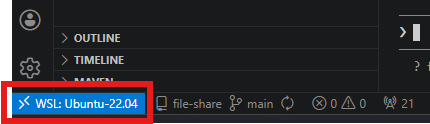

# VSCode の使い方（基本操作と仕組み）

このドキュメントは、VSCode を初めて使う方向けの入門ガイドです。`01_AccountSetup.md` の手順で WSL への接続まで終えた状態を前提に、**研修中に「VSCode の操作が分からなくて手が止まる」ことがないよう**、画面の見方・基本操作・仕組みを先に押さえておくためのものです。研修が始まる前に一度、実際に手を動かしながら目を通しておいてください。

所要時間の目安: 15〜20 分。

---

## このドキュメントのゴール

- VSCode と WSL がどういうもので、どう連携して動いているかが分かる
- 画面のどこに何があるか、迷わず操作できる
- フォルダを開く・ターミナルでコマンドを打つ、が一通りできる
- ターミナルから `claude` を起動できる
- 研修本番で講師の指示についていける状態になる

---

## 1. VSCode と WSL の仕組み（先に知っておくこと）

操作に入る前に、研修で使う **VSCode** と **WSL** が「どういうもので、どう繋がっているか」を押さえておきます。ここが分かっていると、後の操作で迷いにくくなります。

### VSCode はコードエディタ

VSCode（Visual Studio Code）は、Microsoft が無料で提供しているコードエディタです。文章やプログラムを書くための「高機能なメモ帳」だと考えてください。標準のままでも使えますが、**拡張機能（Extensions）** を追加することで、言語ごとの入力補助や外部環境への接続など、できることが増えていきます。

> **補足:** 拡張機能は Extensions view（`Ctrl+Shift+X`）で検索・追加します。`01_AccountSetup.md` で入れた「Office Viewer」もこの拡張機能のひとつです。

### プロジェクト（ワークスペース）を開いて作業する

VSCode はファイルを1つずつ開くだけでなく、**作業フォルダごと開く**のが基本です。研修で扱う一式のフォルダ（＝**プロジェクト**）を開くと、その「VSCode で開いているフォルダのまとまり」が **ワークスペース** になります。

- フォルダを開くと、左の**エクスプローラー**にその中のファイルがツリー表示され、関連ファイルをまとめて扱えます。
- 「いまどのフォルダを開いているか」がそのまま作業の対象です。ターミナルを開いたときの初期位置も、基本はこの開いているフォルダになります。

> **補足:** 細かくは「1つのフォルダ＝ワークスペース」「複数フォルダをまとめた構成」などの区別もありますが、研修では **「作業するプロジェクトのフォルダを1つ開く」** と捉えておけば十分です。

### WSL とは何か

研修では、Windows パソコンの中で **WSL（Windows Subsystem for Linux）** という仕組みを使い、**Linux（Ubuntu）** を動かします。イメージとしては、**1台のパソコンの中に「Windows の世界」と「Linux の世界」が同居している**状態です。

- **Windows の世界**: いつものデスクトップ・ブラウザ・エクスプローラーなど。
- **Linux の世界（WSL）**: 開発用のコマンドやツールが動く場所。研修で打つコマンドはこちらで動きます。

> **なぜ Linux を使うの？:** 開発で使うツールは Linux 上で動かすのが標準で、その方が動作が安定し、手順もみんなで共通化しやすいためです。WSL を使えば、ふだんの Windows パソコンはそのままに、必要なときだけ Linux を呼び出せます。

- 研修資料やコードなどのファイルは、基本的に **Linux 側のホーム（`/home/<ユーザー名>`）** に置きます（`01_AccountSetup.md` の手順で研修資料を Linux 側へ置くのはこのためです）。
- WSL 自体のセットアップは、お渡しする PC で事前に済ませてあります。ここでは「**Windows の中で Linux が動いている**」というイメージが掴めれば十分です。

### ★ 一番大事な仕組み: 画面は Windows・中身は WSL

ここが、初めての方がいちばん戸惑うポイントです。

- VSCode の**画面（ウィンドウ）そのものは Windows 上で動いています**。
- 一方で `01_AccountSetup.md` で行った「Connect to WSL」によって、**ファイルの置き場所やコマンドの実行先は WSL（Linux）側に切り替わっています**。

> **イメージ:** VSCode は「Windows 側のリモコン」、実際に動いている本体は「WSL（Linux）側」、という二人三脚の状態です。

[図: 「Windows の画面（VSCode のウィンドウ＝リモコン）」と「WSL / Linux（ファイル・コマンドの実行先＝本体）」を左右に並べ、矢印で「Connect to WSL でつながる」ことを示すポンチ絵]

このため、

- 画面は見慣れた Windows のアプリなのに、
- 後で開くターミナルは Linux（bash）になっている、

という一見ふしぎな状態になります。これは正常です。画面左下のステータスバーに **「WSL: Ubuntu-22.04」** と出ていれば、「いま WSL に繋がっている」というサインです。



> **補足:** 左下が「WSL: ...」になっていない場合は、まだ WSL に接続できていません。左下の **`><`** アイコンから「Connect to WSL」で接続するか、`01_AccountSetup.md` の「WSL起動」手順に戻ってください。

---

## 2. 画面の見方

VSCode の画面は、大きく次の5つのエリアでできています。まずはこの地図を頭に入れましょう。

[スクリーンショット: VSCode 全体。アクティビティバー / サイドバー / エディタ / パネル / ステータスバーを枠で囲って番号を振る]

| エリア | 場所 | 役割 |
|---|---|---|
| アクティビティバー | 左端の縦アイコン列 | 表示の切り替え（ファイル一覧・検索・拡張機能 など） |
| サイドバー | アクティビティバーの右隣 | 選んだ表示の中身（例: エクスプローラー＝ファイル一覧） |
| エディタ | 中央の広い領域 | ファイルを開いて読み書きする場所 |
| パネル | 下部 | ターミナルや出力が表示される場所 |
| ステータスバー | 最下部の細い帯 | 接続先（左下の「WSL: ...」表示）や現在の状態 |

一番よく使うのは、左端の一番上にある **エクスプローラー**（紙が重なったアイコン）です。ここに、開いているフォルダの中のファイルが一覧表示されます。

---

## 3. コマンドパレット（やりたい操作を探す）

VSCode の機能は数が多く、メニューのどこにあるか探すのは大変です。そんなときに使うのが**コマンドパレット**です。

- `Ctrl+Shift+P` を押すと、画面上部に入力欄が出ます。
- ここに「やりたいこと」のキーワードを打つと、該当する機能が候補に出てきます（例: 「terminal」でターミナル関連、「open folder」でフォルダを開く）。

> **使いどころ:** これは「**やりたい操作のメニューがどこにあるか分からない**」ときに、キーワードで機能を探して実行する道具です（何でも解決する万能ツールではありません）。`01_AccountSetup.md` の WSL 接続も `Ctrl+Shift+P` →「WSL: Connect to WSL」で行えます。

[スクリーンショット: Ctrl+Shift+P でコマンドパレットが開いた状態]

---

## 4. ファイルとフォルダの基本操作

### フォルダを開く

- メニューバー → **File** → **Open Folder**（`Ctrl+K, Ctrl+O`）から、WSL 上の作業用フォルダを選んで開きます。
- 2回目以降は **File** → **Open Recent** から直接開けます。
- ターミナルから `cd` で移動して `code .` で開く方法もあります（第5章「ターミナルからフォルダを開く」を参照）。

> **補足:** 研修では開くフォルダを講師が指定します。ここでは「フォルダを開く操作の場所」を覚えておけば十分です（詳しい手順は `01_AccountSetup.md` にあります）。

[スクリーンショット: フォルダを開き、左のエクスプローラーにファイルツリーが表示された状態（できれば `File → Open Folder` メニューを開いたところも）]

### 新規作成・名前の変更

- エクスプローラーの空白部分を右クリック →「新しいファイル」/「新しいフォルダー」で作成できます。
- ファイル名を右クリック →「名前の変更」でリネームできます。

---

## 5. ターミナルを使う

研修で打つコマンドは、すべて VSCode の中の**ターミナル**で実行します。

### ターミナルを開く

- **`Ctrl+@`**（またはメニューバー → **Terminal** → **New Terminal**）でターミナルを開きます。
- 画面下部にターミナル（パネル）が開きます。

[スクリーンショット: Ctrl+@ でターミナルが開き、プロンプトが見える状態]

### WSL（Linux）に繋がっていることを確認

ターミナルが開いたら、次を打って Enter を押します。

```bash
pwd
```

> **結果例**
> ```
> /home/<あなたのユーザ名>
> ```
> `/home/...` のような Linux のパスが表示されれば、WSL のターミナルが開けています（Windows の `C:\...` ではありません）。

> **補足:** これが「画面は Windows でも、コマンドは Linux 側で動いている」状態です（第1章の仕組みのとおり）。研修で出てくるコマンドは、すべてこのターミナルに打ち込みます。

### ターミナルからフォルダを開く（`cd` → `code .`）

ターミナルが開けたら、コマンドで目的のフォルダに移動して、そのフォルダを VSCode で開くこともできます。慣れるとこちらが速いです。

```bash
# いまいる場所にあるフォルダ・ファイルを確認する
ls

# 目的のフォルダへ移動する（例: ホーム直下の myproject）
cd ~/myproject

# いま開いているフォルダを VSCode で開く
code .
```

- `cd <フォルダ名>` で移動します。`cd ..` で1つ上のフォルダに戻り、`ls` で中身を一覧できます。
- `code .` は「**いまいるフォルダを VSCode で開く**」コマンドです。`code` のあとに**半角スペースとドット（`.`）** が必要で、`.` は「いまいるフォルダ」を表します。

> **`~/` の意味:** `~`（チルダ）は **自分のホームフォルダ**（`/home/<あなたのユーザ名>`）を指します。つまり `~/myproject` は「ホームフォルダの中の myproject」という意味です。どのフォルダにいても `cd ~` でホームフォルダに戻れます。

> **補足:** `code` コマンドは VSCode 内の WSL ターミナルで使えます。はじめて `code .` を実行するときは、準備のため数秒かかることがあります。

---

## 6. Claude（`claude` コマンド）を起動してみる

研修で使う AI アシスタント（Claude Code）は、ターミナルから `claude` コマンドで起動します。最後に、起動できることを確かめておきましょう。

1. `Ctrl+@` でターミナルを開く（第5章）。
2. 次を打って Enter を押す。

```bash
claude
```

3. 起動すると、ターミナルが Claude との対話画面に切り替わります。

[スクリーンショット: `claude` 起動後の対話画面（入力欄が表示された状態）]

> **初回のみ:** はじめて起動するときはログイン（認証）が必要です。手順は `01_AccountSetup.md` の「Claude Code 認証」に従ってください（テーマ選択 → ログイン方法選択 → ブラウザで承認 → 認証コードを貼り付け）。2回目以降はこの認証は不要です。

### 終了のしかた

- 対話画面で `/exit` と打って Enter（または `Ctrl+C`）で終了し、通常のターミナルに戻ります。

> **補足:** `claude` を起動するのは、第5章で開いた **VSCode 内の WSL ターミナル**です（Windows 側のコマンドプロンプトではありません）。

---

## 7. よくあるつまずきと対処

| 症状 | 対処 |
|---|---|
| 左下が「WSL: ...」になっていない | WSL に未接続。左下の **`><`** アイコン →「Connect to WSL」、または `01_AccountSetup.md` の「WSL起動」へ |
| ターミナルを開いたら `C:\...` や `PS C:\>` と出る | Windows 側のシェルが開いている。左下の WSL 接続を確認し、WSL に繋いだ状態で開き直す |
| ターミナルが見当たらない | `Ctrl+@`、またはコマンドパレットで「terminal」 |
| 操作の場所が分からない | `Ctrl+Shift+P` でコマンドパレットを開き、やりたいことを打って探す |

---

## 8. 確認チェックリスト

研修本番に進む前に、次が自分でできるか確認しておきましょう。

- [ ] 画面左下に「WSL: Ubuntu-22.04」と表示されている
- [ ] フォルダを開くと、左のエクスプローラーにファイル一覧が表示された
- [ ] `Ctrl+@` でターミナルを開けた
- [ ] ターミナルで `pwd` を打ち、`/home/...` が表示された（WSL に繋がっている）
- [ ] `Ctrl+Shift+P` でコマンドパレットを開けた
- [ ] ターミナルで `claude` を起動できた（初回は `01_AccountSetup.md` の認証を実施）

すべてチェックできれば、研修中に VSCode の操作で止まることはほぼありません。操作のメニューの場所に迷ったら `Ctrl+Shift+P`（コマンドパレット）でキーワード検索、それでも解決しないときはこのドキュメントを読み返すか、講師に確認してください。
